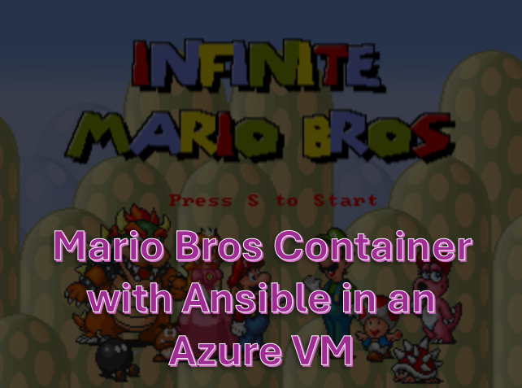
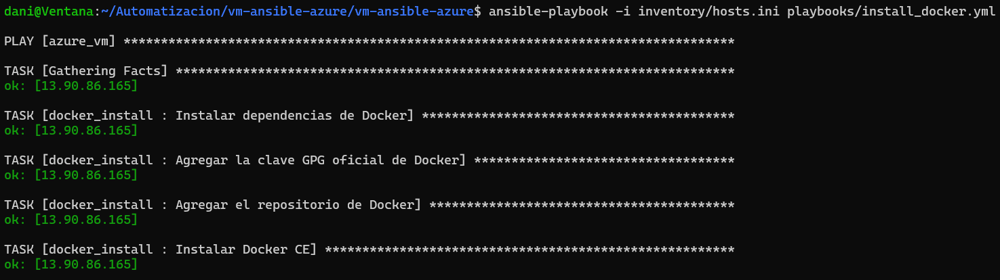
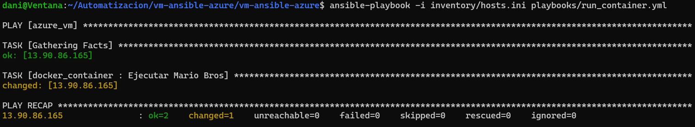
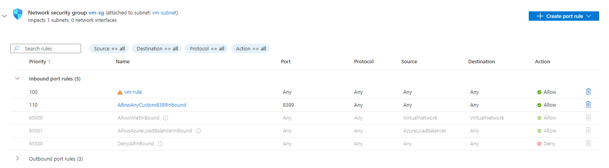
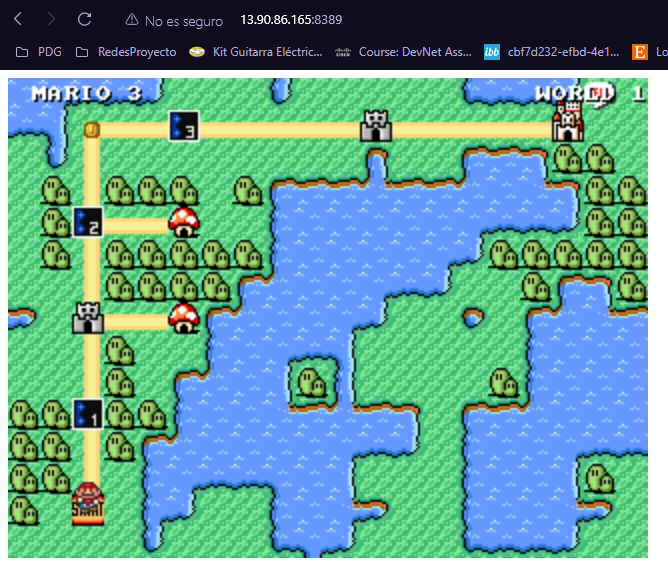

# VM-terraform-ansible

  

En este proyecto se utilizara una maquina virtual ya desplegada y aprovisionada con terraform dividida en modulos y con acceso a dicha maquina mediante ssh con una llave publica, dicho proyecto se encuentra en este repositorio [VM-terraform-azure-modules](https://github.com/DanielRamirez1901/VM-terraform-azure-modules).
En esta maquina se instalara docker, luego un contenedor que contendra una imagen de Mario Bros

## Requisitos 🎯

Para este proyecto necesitaras

- Visual Studio Code
- Terraform instalado en tu maquina
- Cuenta de azure
- Maquina VM de azure ya desplegada y en funcionamiento
- Ansible instalado

Nota: se debe haber ya creado una llave publica, dicha llave sirve para ingresar por ssh y tambien para que ansible pueda acceder a dicha maquina e instalar lo que en las clases se encuentra, por ello se recomienda tener presente la ruta en la que se encuentra la llave ssh con la que se creo la maquina virtua, en este ejemplo, la ruta de esta llave esta de forma local

## Pasos a seguir para la configuracion de Ansible 📖

Primero, crearemos las estructura necesaria para el proyecto, esta debe tener la siguiente forma

    ├── inventory
    │   ├── host.ini
    ├── playbooks
    │   ├── install_docker.yml
    │   ├── run_container.yml
    ├── roles
    │   ├── docker_container
    │   │   ├── tasks
    │   │   │   ├── main.yml
    │   ├── docker_install
    │   │   ├── tasks
    │   │   │   ├── main.yml
    └── ansible.cfg

Ahora, se procedera a explicar el funcionamiento de cada clase

* **host.ini**

Este archivo es el inventario de Ansible, donde se especifican los hosts en los que se ejecutarán los playbooks. En este caso, solo hay un host en la categoría [azure_vm], que tiene la dirección IP de la máquina virtual en Azure. También se especifica el usuario SSH y la ruta a la clave privada SSH que se utilizará para la autenticación.

* **install_docker.yml y run_container.yml:**

Estos son los playbooks de Ansible que se encargan de instalar Docker y ejecutar un contenedor, respectivamente, en la máquina virtual. Ambos playbooks utilizan el mismo host definido en el archivo hosts.ini.

* **main.yml en docker container y docker install:**

Estos archivos contienen las tareas que Ansible ejecutará en la máquina virtual. En docker_container, se define una tarea para ejecutar un contenedor Docker con la imagen de Super Mario Bros en el puerto 8389. En docker_install, se definen las tareas para instalar Docker y sus dependencias en la máquina virtual.

* **ansible.cfg:**

Este archivo es la configuración global de Ansible. En este caso, se especifica la ruta a los roles y al inventario. Los roles son las estructuras de organización y reutilización de tareas en Ansible.

# Deployment 🚀

En el despliegue se realizan dos pasos principales, la instalación de Docker y la ejecución del contenedor. Estos pasos son necesarios para configurar el entorno en la máquina virtual y ejecutar la aplicación.

### Instalación de Docker:

    ansible-playbook -i inventory/hosts.ini playbooks/install_docker.yml

  

El playbook install_docker.yml se ejecuta para instalar Docker y sus dependencias en la máquina virtual. Esto se realiza porque Docker es necesario para ejecutar y administrar contenedores.
Las tareas definidas en docker_install instalan Docker y sus dependencias utilizando los módulos de Ansible adecuados.

### Ejecución del contenedor:

    ansible-playbook -i inventory/hosts.ini playbooks/run_container.yml

  

Una vez que Docker está instalado, se puede ejecutar el contenedor que contiene la aplicación de Super Mario Bros.
El playbook run_container.yml se ejecuta para iniciar el contenedor.

# Configuracion en Azure

En azure debemos añadir el puerto en las configuraciones del networking, para ello accedemos al recurso maquina virtua, luego a network settings y ahi creamos una regla de puerto, en dicha regla se colocara el puerto que definimos en el archivo main.yml que esta en docker_container

  

Ahora, si accedemos con la ip publica de la maquina virtual y el puerto que acabamos de añadir en la regla en nuestro navegador creando la siguiente combinacion

    ip_publica_maquina_virtual:puerto

Ejemplo

    http://13.90.86.165:8389

Obtendremos lo siguiente

  

Y como podemos observar, se encuentra en ejecucion y con correcto funcionamiento lo que en el contenedor se encuentra instalado que en este ejemplo es el Mario Bros

## Realizado por 😎

- **Daniel Ramirez - A00368788**
  - GitHub: [Danilops](https://github.com/DanielRamirez1901)

